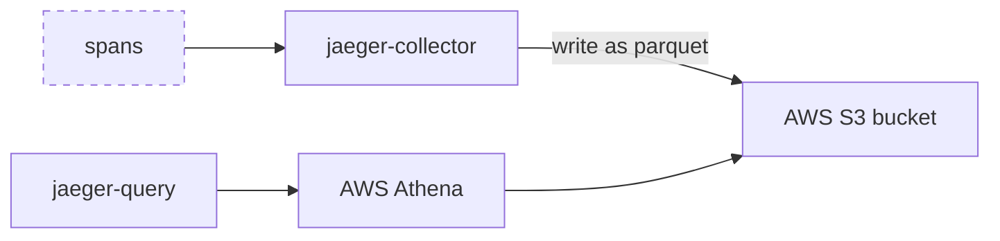

# Architecture

## Overview

The Jaeger S3 GRPC plugin uses [Amazon S3](https://aws.amazon.com/s3/)
to store spans and makes them queryable using [Amazon Athena](https://aws.amazon.com/athena/).

## Writing

Incoming spans are converted to [Parquet](https://parquet.apache.org/), a columnar data store format and partitioned for more efficient querying following the [recommendations from AWS](https://aws.amazon.com/blogs/big-data/top-10-performance-tuning-tips-for-amazon-athena/).

New parquet files are opened by default every 60s and spans streamed into them. We found that 60s is a good compromise between creating files large enough for efficient querying and ensuring some level of realtimeness users expect. If you have different needs you can adjust the `s3.bufferDuration` configuration value.

## Querying

While is Athena is a great fully-managed query engine, query duration is usually seconds and not milliseconds.

To still provide a pleasant user experience we use the ability to fetch past Athena queries and their results to provide a query cache for improved response times and reduced costs.
